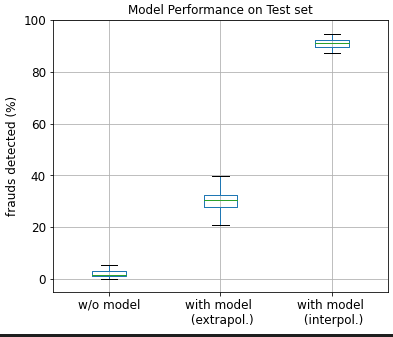

# Fraud detection in bank transactions
by Giacomo Benvenuti

---

[OPEN THE NOTEBOOK IN GITHUB BY CLICKING HERE](https://github.com/GiacomoBenvenuti/Banking_Fraud_Detection/blob/9b534679b42236a5caa908f85fc6f7e764dbab04/Fraud_detection_Main.ipynb)

---

## Motivation
The customer is an issuing bank seeking a machine learning solution to solve a growing fraud problem.

The bank’s customers are having their cards defrauded and their money is being spent by fraudsters. This is causing customer dissatisfaction, so the bank is looking into introducing better transactional monitoring on activity on their customers’ cards. 

They plan to have a small team of fraud analysts who review risky-looking purchases and decide whether to allow or block the transaction. This team will have the capacity to review 400 transactions a month. The scores from my model will be used to decide which transactions the fraud analysts should review. 

**The bank has provided 1 year of historical transactional data and fraud flags and asked me to build a model which predicts the likelihood that a transaction is later marked as fraud**. 

---

## Approach

The goal of this study is the selection of a machine learning pipeline to predict the probability of future frauds based on trasactions features. 

I created many diffent new features and tested several classification algorithms (supervised and unsupervised). 

I found that a Random Forest Classifier produces the best performance. 

I optimized the hyperparameters of this classifier and estimated the performance on the test set. 

Overall, using this model our client will detect 15 times more frauds than by randomly selecting the transactions to check. 

We also start optimizing a shallow neural network for the same task, but for now it underperforms the Random Foreset classifier.  

## Results 
By randomly selecting 400 transactions out of 10.000 each month, the client was able to detect less than the 2% of the total frauds, on average (Fig. below, left box). 

Using the ML pipeline I provide, the client will be able to detect 15 times more frauds (30% of the total, Fig. below central box). 

If the test set was sampled over the same period of time as the training set (by cross-validation) instead of from a period in the future, the performance of the model would be 3 times better (91%, Fig. below right box).  

>Figure 3 | Performance of the model on the test set. 
(**left box**) Fraud detected without the model but picking 400 random transactions out of 10.000. I created 20 test sets (10.000 trans. each) by bootstrapping the last two months of the dataset (20.000 trans.). (**central box**) Fraud detected in trasactions from a period in the future (extrapolation). Same as the left box but now we use the model to select the transactions most likely to be a fraud. (**right box**) Fraud detected in transactions from the same period as the training set (interpolation). I selected 20.000 transactions from the same period of the training set by cross-validation and then I generated 20 test sets using bootstrapping. >  

## Discussion 
This classification task is challenging for many reasons: 
- the unbalance in the target categories (only 1% of frauds)
- the very high detection threshold required by the client (we need to select 400 trials out of 10.000)
- fraudsters constantly optimize their strategy to escape anomaly detection strategies
- Since we train the model over a certain period of time and then predict frauds from a period in the future, this is an extrapolation problem. Since the regularities that we need to learn to make predictions change across time, generalization is more difficult than in simpler interporlation problems. We show that if this was an interpolation problem our model would detect 3 times more frauds. This confirms that the model does a pretty good job in predicting new frauds. The limitations in its performance depend on the variability of the data across time. 

## Conclusions
Despite the challanges of the task summarized above, the ML pipeline I provide will allow the client to detect 15 times more frauds! 
